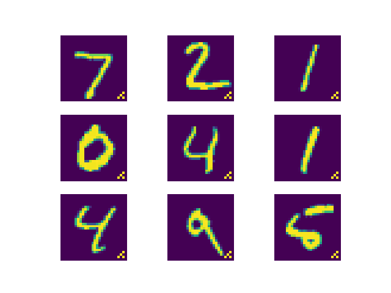

# Intern-Project-Zero
Tiny coding task for internship

All the codes are implemented with pytorch

the BadNet demo can be directly excecuted with ```python BadNet.py```

The ML-Leak demo performs the best with preprocessed dataset from original ML-Leak: https://github.com/AhmedSalem2/ML-Leaks 

## BadNet
### MNIST 

Adversarial images generated: 6000 Bad Imgs, 54000 Clean Imgs (0.10)
Adversarial images generated: 0 Bad Imgs, 10000 Clean Imgs (0.00)
Adversarial images generated: 10000 Bad Imgs, 0 Clean Imgs (1.00)

------ Train start ---------

Epoch: 1 of 25, Loss:0.034,  Train acc: 0.8522, Test_ori acc: 0.9331, Test_tri acc: 0.1085

Epoch: 2 of 25, Loss:0.024,  Train acc: 0.8685, Test_ori acc: 0.9505, Test_tri acc: 0.1190

Epoch: 3 of 25, Loss:0.017,  Train acc: 0.9541, Test_ori acc: 0.9596, Test_tri acc: 0.9101

Epoch: 4 of 25, Loss:0.007,  Train acc: 0.9670, Test_ori acc: 0.9635, Test_tri acc: 0.9906

Epoch: 5 of 25, Loss:0.005,  Train acc: 0.9650, Test_ori acc: 0.9590, Test_tri acc: 1.0000

Epoch: 10 of 25, Loss:0.003,  Train acc: 0.9837, Test_ori acc: 0.9795, Test_tri acc: 0.9991

Epoch: 15 of 25, Loss:0.002,  Train acc: 0.9876, Test_ori acc: 0.9836, Test_tri acc: 0.9990

Epoch: 20 of 25, Loss:0.002,  Train acc: 0.9913, Test_ori acc: 0.9858, Test_tri acc: 0.9995

Epoch: 21 of 25, Loss:0.002,  Train acc: 0.9916, Test_ori acc: 0.9861, Test_tri acc: 0.9987

Epoch: 22 of 25, Loss:0.002,  Train acc: 0.9916, Test_ori acc: 0.9872, Test_tri acc: 0.9985

Epoch: 23 of 25, Loss:0.002,  Train acc: 0.9918, Test_ori acc: 0.9872, Test_tri acc: 0.9960

Epoch: 24 of 25, Loss:0.002,  Train acc: 0.9918, Test_ori acc: 0.9863, Test_tri acc: 0.9979

Epoch: 25 of 25, Loss:0.001,  Train acc: 0.9924, Test_ori acc: 0.9867, Test_tri acc: 0.9965




## ML-Leak
### Cifar10
Classification Report Shadow Net:
              precision    recall  f1-score   support

           0       0.57      0.57      0.57      1000
           1       0.71      0.61      0.66      1000
           2       0.43      0.42      0.43      1000
           3       0.39      0.28      0.32      1000
           4       0.49      0.44      0.47      1000
           5       0.44      0.50      0.47      1000
           6       0.65      0.59      0.62      1000
           7       0.54      0.67      0.60      1000
           8       0.62      0.71      0.66      1000
           9       0.57      0.64      0.60      1000
    
    accuracy                           0.54     10000
    macro avg      0.54      0.54      0.54     10000
    weighted avg   0.54      0.54      0.54     10000

Classification Report Target Net:
              precision    recall  f1-score   support

           0       0.61      0.56      0.59      1000
           1       0.72      0.63      0.67      1000
           2       0.42      0.38      0.40      1000
           3       0.39      0.37      0.38      1000
           4       0.43      0.47      0.45      1000
           5       0.46      0.41      0.43      1000
           6       0.64      0.63      0.64      1000
           7       0.55      0.65      0.60      1000
           8       0.65      0.70      0.68      1000
           9       0.59      0.67      0.63      1000
    
    accuracy                           0.55     10000
    macro avg      0.55      0.55      0.55     10000
    weighted avg   0.55      0.55      0.55     10000

Report of Attack Net
              precision    recall  f1-score   support

         0.0       0.99      0.69      0.81     10520
         1.0       0.76      0.99      0.86     10520
    
    accuracy                           0.84     21040
    macro avg      0.87      0.84      0.84     21040
    weighted avg   0.87      0.84      0.84     21040